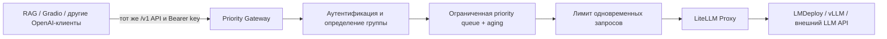

# Балансировка и приоритизация запросов перед LiteLLM

## Задача

Цель — сократить ожидание интерактивных запросов при перегрузке LLM-сервиса, не меняя OpenAI-compatible контракт клиентских приложений. Для этого перед LiteLLM добавлен отдельный priority gateway. Он выполняет admission control, определяет группу пользователя, ставит запрос в ограниченную очередь и допускает к LiteLLM только тогда, когда освобождается один из разрешённых параллельных слотов.

LiteLLM остаётся внутренним LLM gateway: унифицирует API, выбирает deployment, выполняет retry/fallback и отправляет запрос в инференс-движок. Новый слой отвечает только за порядок допуска запросов. Такое разделение необходимо, потому что запрос, уже переданный в LiteLLM или модельный сервер, обычно нельзя безопасно вытеснить более приоритетным запросом.

## Схема размещения



Клиентский API не меняется. Клиент по-прежнему использует `Authorization: Bearer ...` и маршруты `/v1/chat/completions`, `/v1/responses` или `/v1/models`. Gateway сопоставляет уже выданный ключ с группой, заменяет его внутренним ключом LiteLLM и не передаёт клиентский секрет дальше.

## Группы и алгоритм

В базовой политике предусмотрены три группы:

| Группа | Базовый приоритет | Назначение |
|---|---:|---|
| `critical` | 0 | интерактивный RAG и пользователи с жёстким SLA |
| `standard` | 10 | обычные пользовательские запросы |
| `batch` | 20 | фоновые эксперименты и пакетная генерация |

Чем меньше число, тем раньше запрос будет выбран. Среди запросов с одинаковым эффективным приоритетом сохраняется FIFO-порядок.

Чтобы низкоприоритетный трафик не зависал при непрерывном потоке `critical`, используется aging:

```text
effective_priority = base_priority - waiting_seconds / aging_interval_seconds
```

При текущем `aging_interval_seconds=0.5` эффективный приоритет уменьшается на единицу каждые 0.5 секунды ожидания. Значит, старый `standard`-запрос сравняется с новым `critical` примерно через 5 секунд, а `batch` — примерно через 10 секунд. При равенстве победит более старый запрос. Дополнительно установлен жёсткий `starvation_timeout_seconds=15`: запросы, превысившие этот срок, обслуживаются раньше ещё не просроченных и между собой идут по FIFO. Это даёт гарантию прогресса даже при постоянной перегрузке более высокого класса.

Очередь ограничена. Если в ней уже 200 запросов, gateway возвращает HTTP 429 вместо неограниченного расхода памяти. Если запрос не получил слот за 120 секунд, возвращается HTTP 503. Слоты удерживаются до получения полного ответа, включая streaming-ответы.

## Настройка без изменения клиентов

Политика хранится в `deploy/priority_gateway/priorities.yaml`. В ней можно менять:

- соответствие API-ключей и заголовков группам;
- числовые приоритеты групп;
- стратегию `fifo` / `priority_aging`;
- число параллельных запросов;
- размер очереди, timeout, скорость aging и жёсткий срок защиты от starvation.

Изменения правил и приоритетов подхватываются по времени изменения YAML-файла. Если новая версия YAML невалидна, процесс продолжает использовать последнюю корректную политику, а ошибка отображается в `/health`. Параметры ёмкости самого scheduler (`max_concurrency`, размер очереди и aging interval) применяются после перезапуска gateway, потому что безопасная замена активной очереди на лету может потерять запросы.

По умолчанию включено `authentication.required: true`: неизвестный ключ получает HTTP 401, а не доступ с обычным приоритетом. Секреты задаются переменными окружения и не хранятся в YAML или Git.

## Методика эксперимента

Сравнивались две стратегии:

1. `fifo` — запросы выполняются в порядке поступления независимо от группы;
2. `priority_aging` — базовый приоритет группы плюс защита от starvation.

Зафиксированные условия:

| Параметр | Значение |
|---|---|
| Параллельные слоты | 1, 2, 4, 8 |
| Повторы | 3 на конфигурацию |
| Запросы в прогоне | 45 |
| Смесь | 9 critical, 21 standard, 15 batch |
| Downstream latency | 100 ms на запрос |
| Всего измерений | 1080 запросов |
| Ошибки | 0 |

Перед началом каждого прогона все запросы помещались в очередь. Downstream был детерминированным LiteLLM-compatible симулятором с одинаковой длительностью обработки. Это исключает влияние сети, разной длины ответа и случайной скорости модели и позволяет измерить именно работу очереди. Измерялись queue time, processing latency, end-to-end latency и общая пропускная способность.

## Результаты

### Среднее время ожидания

| Slots | Группа | FIFO, ms | Priority + aging, ms | Изменение |
|---:|---|---:|---:|---:|
| 1 | critical | 2257.8 | 436.3 | -80.7% |
| 1 | standard | 2538.4 | 2052.8 | -19.1% |
| 1 | batch | 2309.1 | 3988.4 | +72.7% |
| 2 | critical | 1082.2 | 207.6 | -80.8% |
| 2 | standard | 1146.6 | 1018.1 | -11.2% |
| 2 | batch | 1299.8 | 1998.5 | +53.8% |
| 4 | critical | 564.5 | 87.4 | -84.5% |
| 4 | standard | 536.1 | 491.0 | -8.4% |
| 4 | batch | 624.3 | 977.7 | +56.6% |
| 8 | critical | 264.4 | 22.2 | -91.6% |
| 8 | standard | 270.4 | 221.5 | -18.1% |
| 8 | batch | 233.0 | 465.4 | +99.7% |

Приоритизация снизила среднее ожидание `critical` на 80.7–91.6%. Цена этого результата — более долгое ожидание `batch`. Это ожидаемое поведение: scheduler не ускоряет генерацию, а отдаёт ограниченный ресурс более важным запросам.

### Пропускная способность

| Slots | FIFO, req/s | Priority + aging, req/s | Разница |
|---:|---:|---:|---:|
| 1 | 9.186 | 9.283 | +1.06% |
| 2 | 18.028 | 18.009 | -0.11% |
| 4 | 34.674 | 34.585 | -0.26% |
| 8 | 69.278 | 69.220 | -0.08% |

Разница throughput находится в пределах 1.06%. Механизм почти не влияет на общую производительность: число слотов и время downstream-обработки одинаковы. Он меняет порядок, в котором разные группы получают результат. Абсолютные значения времени немного зависят от планировщика ОС, поэтому воспроизводимым выводом считается устойчивое направление эффекта, а не совпадение миллисекунд до десятых.

Для выбранной начальной конфигурации `max_concurrency=4` среднее ожидание `critical` уменьшилось с 564.5 до 87.4 ms, а p95 end-to-end latency составила 341.0 ms в контролируемом тесте. Четыре слота выбраны как безопасная отправная точка, а не универсальный production optimum: реальный лимит нужно связать с результатами инференс-движка и доступной VRAM.

## Дополнительный эксперимент: Token-Aware routing

Priority scheduler определяет, какой пользовательский запрос должен получить ресурс первым. После допуска запроса остаётся второй вопрос: на какую из нескольких LLM-реплик его отправить. Round Robin и Least Requests считают все запросы одинаковыми, хотя prompt на 200 токенов и генерация на 50 токенов намного дешевле prompt на 4000 токенов с длинным ответом.

Для исследования реализован token-aware маршрутизатор. В исходной формуле все компоненты нагрузки должны иметь положительный знак:

```text
estimated_service = input_tokens / prefill_tokens_per_second
                  + expected_output_tokens / decode_tokens_per_second

replica_score = outstanding_estimated_service
              + estimated_service_of_new_request
              + gamma * queue_size
              + delta * estimated_kv_tokens / kv_capacity_tokens
```

Использованы `prefill=6000 token/s`, `decode=300 token/s`, `gamma=0.005 s` и `delta=0.25 s`. Разные скорости prefill/decode отражают важную особенность авторегрессионной генерации: один будущий выходной токен в этой модели стоимости примерно в 20 раз дороже одного входного токена.

Сравнивались пять стратегий:

| Стратегия | Что учитывает |
|---|---|
| `round_robin` | только циклический порядок реплик |
| `least_requests` | количество незавершённых запросов |
| `token_max` | вход и заявленный клиентом `max_tokens` |
| `token_ewma` | вход и исторический EWMA-прогноз ответа по типу запроса |
| `oracle` | фактическую длину будущего ответа; используется только как эталон точной оценки |

EWMA обучается не на текущем тестовом burst, а на отдельной истории завершённых запросов. Получены оценки: FAQ — 78, обычный RAG — 254, длинный анализ — 935 выходных токенов. Для сравнения использовался WAPE: суммарная абсолютная ошибка прогноза, делённая на фактическое число выходных токенов.

Эксперимент проведён для 12, 36, 72 и 144 одновременных запросов, на трёх репликах, с пятью повторами. Проверены два сценария:

1. `empty_pool` — все реплики свободны;
2. `residual_load` — перед новым burst на репликах уже остаётся 15 000, 4 000 и 9 000 незавершённых токенов.

Во втором сценарии обычное количество активных запросов на репликах одинаково, но их реальная оставшаяся стоимость различается. Поэтому Round Robin и Least Requests не видят разницу, а Token-Aware направляет первые запросы на вторую реплику и затем выравнивает прогнозируемое время завершения.

### Результат на residual load, burst=144

| Стратегия | p95 E2E, ms | Makespan, ms | Throughput, req/s | Load CV | Output WAPE |
|---|---:|---:|---:|---:|---:|
| Round Robin | 93823.6 | 102825.7 | 1.403 | 0.2063 | — |
| Least Requests | 93823.6 | 102825.7 | 1.403 | 0.2063 | — |
| Token-Aware max | 83871.8 | 93025.1 | 1.550 | 0.1212 | 223.4% |
| Token-Aware EWMA | 77509.5 | 84216.3 | 1.711 | 0.0362 | 29.3% |
| Oracle estimate | 78001.7 | 81512.6 | 1.768 | 0.0080 | 0% |

Относительно Round Robin практический вариант `token_ewma`:

- снизил p95 end-to-end latency на 17.39%;
- уменьшил makespan всего burst на 18.10%;
- увеличил throughput на 21.94%;
- уменьшил коэффициент вариации нагрузки между репликами на 82.45%;
- снизил ошибку оценки выхода с 223.4% у консервативного `max_tokens` до 29.3%.

На пустом пуле и больших burst преимущество меньше: случайное распределение само становится равномернее. Это важный результат, а не недостаток эксперимента. Token-Aware даёт наибольшую пользу при коротких burst, тяжёлом хвосте размеров запросов и неодинаковой остаточной загрузке реплик — именно в ситуациях, где количество запросов плохо описывает реальную работу.

Графики:

- [p95 latency при residual load](../data/experiments/priority_gateway/token_aware/plots/residual_load_p95_latency_vs_batch.svg);
- [дисбаланс реплик при residual load](../data/experiments/priority_gateway/token_aware/plots/residual_load_load_imbalance_vs_batch.svg);
- [throughput при residual load](../data/experiments/priority_gateway/token_aware/plots/residual_load_throughput_vs_batch.svg).

Для multi-replica deployment выбран `token_ewma` как лучший практически применимый вариант. `token_max` не требует истории, но слишком сильно завышает будущий выход. `oracle` недоступен в реальной системе и служит контрольной точкой. До появления нескольких реальных LiteLLM-реплик Token-Aware остаётся экспериментальным routing-модулем и не меняет стабильный однорепличный runtime.

## Что интегрировано в проект

- OpenAI-compatible reverse proxy на FastAPI;
- priority scheduler с FIFO внутри класса и aging между классами;
- bounded queue, queue timeout и корректная обработка отмены запроса;
- поддержка обычных и streaming-ответов;
- аутентификация по существующему Bearer key и замена его ключом LiteLLM;
- горячая перезагрузка правил с last-known-good fallback;
- `/health` и `/metrics` со состоянием очереди и статистикой по группам;
- Docker Compose `Priority Gateway → LiteLLM`;
- поддержка `RAG_LLM_PROVIDER=litellm` в основном RAG;
- воспроизводимый benchmark, raw CSV, JSON и агрегированная таблица.
- Docker-воспроизводимый Token-Aware benchmark для трёх реплик, пяти стратегий и двух сценариев остаточной нагрузки.

## Ограничения

- Эксперимент изолирует scheduler и не является замером конкретной LLM. На production-контуре его нужно повторить через LiteLLM с выбранной моделью и реальными длинами prompt/answer.
- Scheduler не прерывает уже начатую генерацию. Приоритет влияет только на ожидающие запросы.
- Текущая очередь хранится в памяти одного процесса. Для нескольких реплик gateway потребуется общий broker/scheduler, например Redis, либо sticky routing и согласованные квоты.
- Один длинный streaming-запрос занимает слот до закрытия потока. Для него полезны отдельный timeout и отдельная группа нагрузки.
- Priority не заменяет rate limit и бюджеты LiteLLM. Эти механизмы дополняют друг друга.
- Token-Aware результаты получены на детерминированной модели prefill/decode, а не на трёх физических GPU. Перед production-включением коэффициенты и EWMA необходимо откалибровать по телеметрии выбранного инференс-движка.

## Воспроизведение

Контролируемый эксперимент на Windows:

```powershell
powershell -ExecutionPolicy Bypass -File scripts/run_priority_experiment.ps1
```

Token-Aware эксперимент в Docker:

```powershell
powershell -ExecutionPolicy Bypass -File scripts/run_token_routing_experiment.ps1
```

Локальный вариант без Docker:

```powershell
powershell -ExecutionPolicy Bypass -File scripts/run_token_routing_experiment.ps1 -Local
```

Полный стек на хосте, где уже доступен OpenAI-compatible LLM endpoint:

```powershell
Copy-Item deploy/priority_gateway/.env.example deploy/priority_gateway/.env
docker compose --env-file deploy/priority_gateway/.env -f deploy/priority_gateway/compose.yaml up -d --build
```

После запуска внешний endpoint — `http://127.0.0.1:4000/v1`, LiteLLM доступен только внутри Docker-сети. Результаты эксперимента находятся в `data/experiments/priority_gateway/baseline/`.

## Источники

- [LiteLLM: OpenAI-compatible Proxy Server, routing, authentication and rate limiting](https://docs.litellm.ai/)
- [LiteLLM v1.89.0 — зафиксированная версия контейнера](https://github.com/BerriAI/litellm/releases/tag/v1.89.0)
